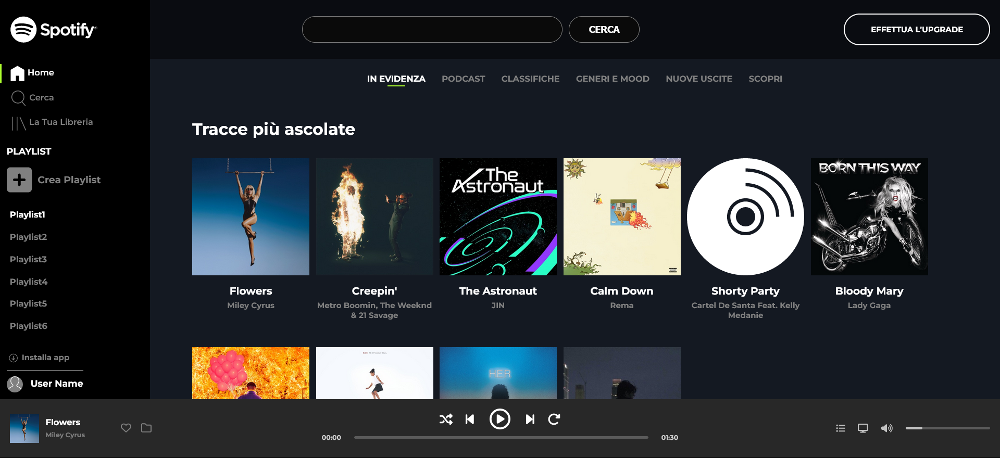
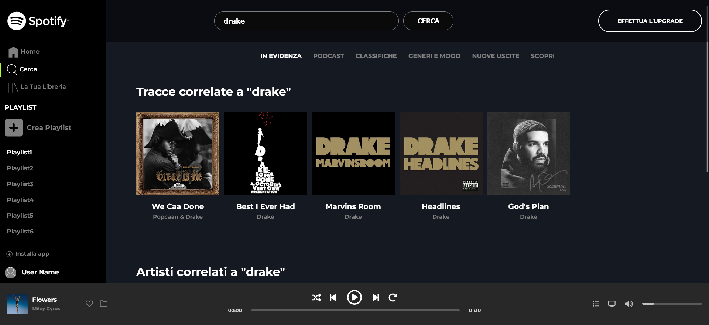
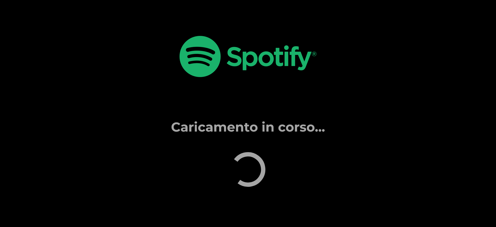
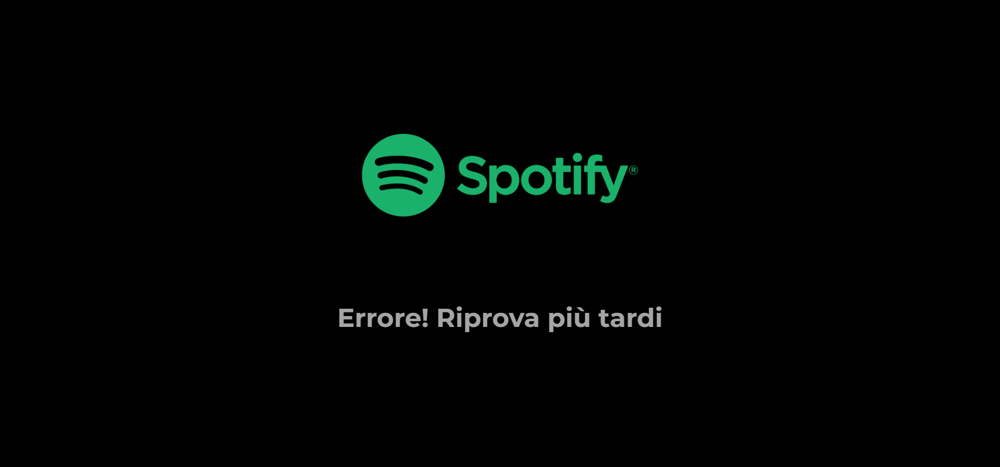

## Spotify WebApp With Vue.js (Version IT)

A clone of spotify, created using an API from which covers, titles and tracks of songs are taken, with many features that make it dynamic, it also includes a loader and error handling API

## Features

In this version of spotify it is possible to actually listen to the songs, manage play/pause, it is possible to search for songs, using the search bar, with a click, the selected song is displayed in the player, and it is possible to switch between the tracks and the timebar actually runs in sync with the track. The webapp is also composed of a loader and a warning in case of errors coming from the API.

## Framework/Library

#Vite for building, #Vue for structure, #Sass for style, #Axios for call API .

## Home Page

## Search Page

## Loading Page

## Error Page

